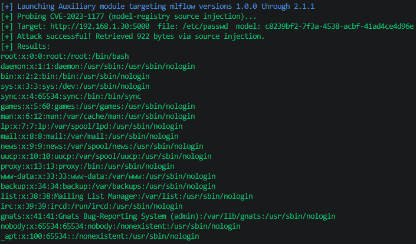

# CVE Description
**CVE Description:** MLflow versions 2.1.1 and earlier contain an unauthenticated arbitrary file read vulnerability in the model registry, where the source field accepted during model version creation is stored verbatim without validation, allowing an attacker to inject a file:// URI pointing at any directory on the server's filesystem. By subsequently calling GET /model-versions/get-artifact with the injected model version, an unauthenticated remote attacker can read arbitrary files from the host — including /etc/passwd, application secrets, and SSH keys — with no credentials required.

**Impacted Versions:** MLFlow versions 1.0.0 - 2.1.1


# Auxiliary Module
```bash
flowhound scan --url http://192.168.1.30:5000 --f_path /etc/passwd --cve CVE-2023-1177
```


