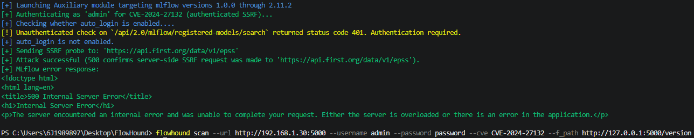

# CVE Description
**CVE Description:** MLflow versions 1.0.0 through 2.11.2 are vulnerable to an authenticated Server-Side Request Forgery (SSRF) attack via the artifact listing endpoint. An attacker with valid credentials can create an experiment pointing to a remote HTTP/HTTPS artifact location, triggering server-side requests when listing artifacts.

**Impacted Versions:** MLflow versions 1.0.0 through 2.11.2


# Auxiliary Module
```bash
flowhound scan --url http://192.168.1.30:5000 --username admin --password password --cve CVE-2024-27132 --f_path http://127.0.0.1:5000/version
```


